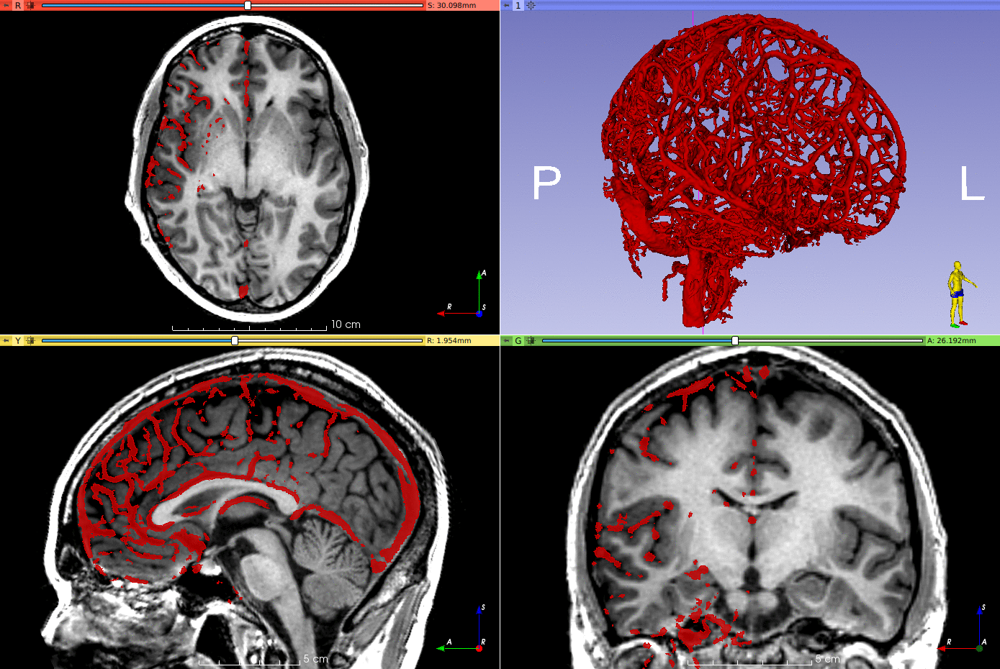

# Vesseg

Brain vessel segmentation from digital subtraction angiography (DSA) using a 3D convolutional neural network (CNN).


(Brain parcellation performed using [GIF](https://spiral.imperial.ac.uk/bitstream/10044/1/30755/4/07086081.pdf), not included in this repository).

## Installation

### GPU support

This package uses [NiftyNet](https://github.com/NifTK/NiftyNet), which is built on top of [TensorFlow](https://www.tensorflow.org/), so first of all you need to follow the [instructions to setup your NVIDIA GPU](https://www.tensorflow.org/install/gpu).

While it is possible to perform a segmentation without a GPU, inference of one large volume (512 × 512 × 394 voxels) using the default parameters takes one hour using CPU only and around 90 seconds using a GPU.

### `vesseg` package

Using [`conda`](https://conda.io/docs/) is recommended:

```shell
$ conda create -n "vesseg" python=3.6 -y  # tensorflow doesn't support python 3.7 yet
$ conda activate "vesseg"
(vesseg) $ git clone "https://github.com/fepegar/vesseg.git" --depth 1
(vesseg) $ pip install --editable "./vesseg"
```

## Usage

```shell
$ conda activate vesseg
(vesseg) $ vesseg dsa_image.nii.gz dsa_vessels_seg.nii.gz
(vesseg) $ bin2mesh dsa_vessels_seg.nii.gz dsa_vessels_mesh.vtp
```

Tested on Linux and macOS.
